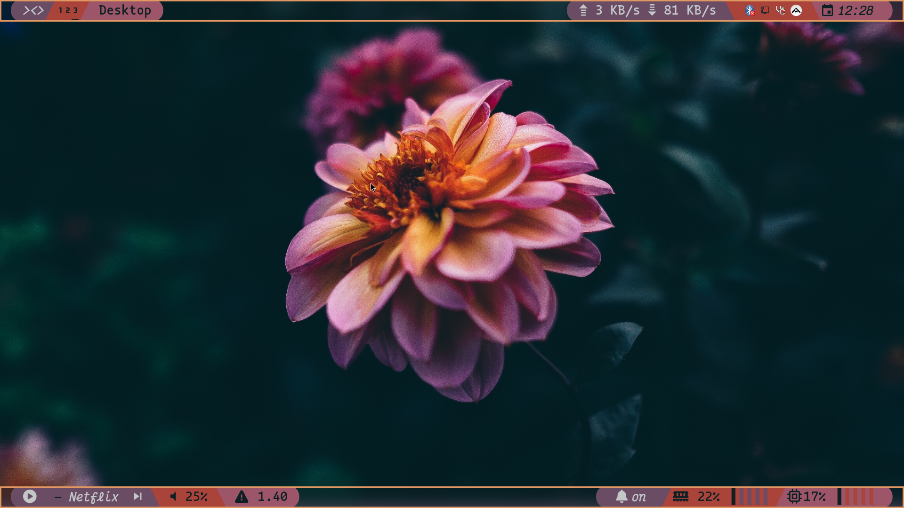
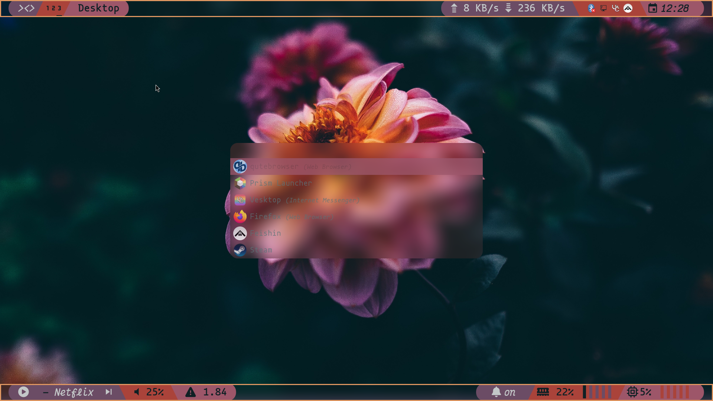
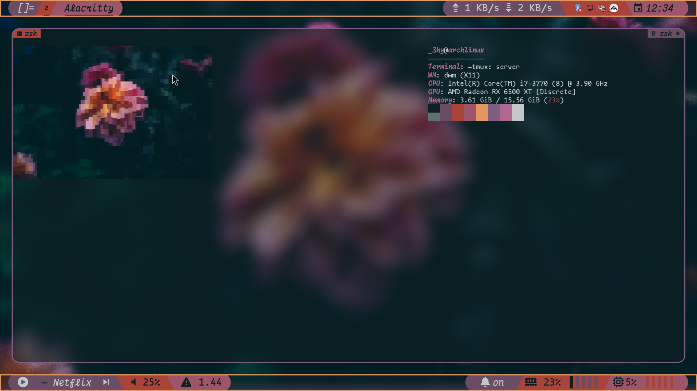

# dwm-rice 
after using I3 for around 3 years I decided to move over to a more obscure window manager DWM, best decision of my life.
This Config has full pywal support and animations provided by the official picom compositor, because this isent really a project im not going to go indepth about all of the features but I will list some things that personally ive never seen on a config.
- Dual bars
    - I wrote custom code in the dwm.c file to support multiple bars
- custom polybar xworkspaces and dwm window mode using the dwm-ipc patch.

